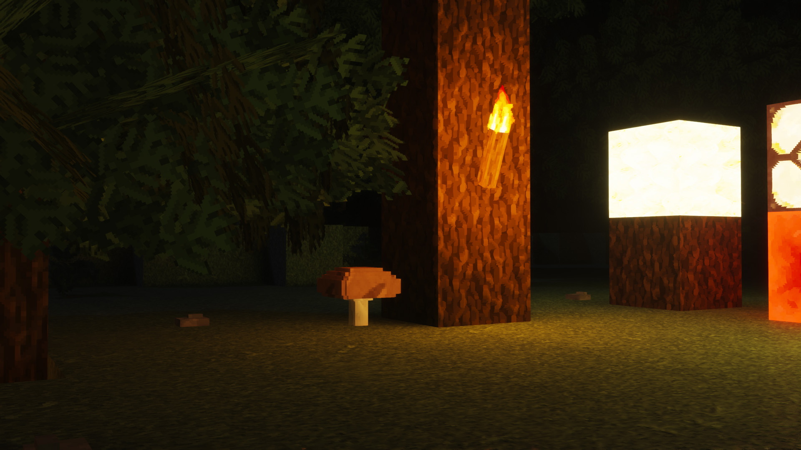
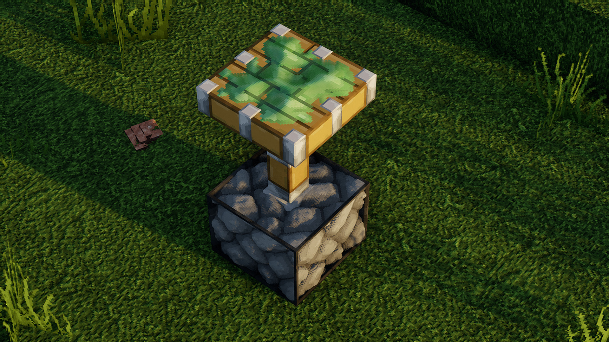

# FaithForge

  

Just an ordinary but definitely not a simple faithful edit. 64 pixels of pure rgba, and that's squared! per texture!

## For instalation head to [releases](https://github.com/BentoGambin/FaithForge-64x/releases) and get latest FaithForge-64x.zip!

Normal and specullar mapping support is HEAVILY encouraged, POM is optional but also recommended.

### Recommended setup:
- Configs (in game):
  - Clouds: OFF
  - Natural Textures: ON
  - Alternate textures: ON
  - CTM: Fancy
  - Trees: Smart

### Shader Configs
  - Chocapic13's & Loop v2:
    - POM depth Write: false (bugs out some models, mainly some Overlays, apotheosis bookshelves and fansmod ( 90%fixed ), if the last two are not present, it can probably be left as true);

### Resourcepacks (by load order):
  - 1 - Faifhforge
  - 2 - New Faithful Items (latest)   [ https://faithful.team/lethalchickens-faithful-items/ ]
  - 3 - Faithful32 (latest)           [https://faithful.team/tag/faithful/]
  - 4 - Mod Resources
  - 5 - Vanilla
      
### Shaderpacks (prefered):
  - Kappa                         [ https://rre36.com/kappa-shader ]
  - Loop v2                       [ https://github.com/espen96/Loop/tree/loop2 ]
  - Chocapic13                    [ https://www.curseforge.com/minecraft/customization/chocapic13-shaders ]
  - Complementary                 [ https://www.curseforge.com/minecraft/customization/complementary-shaders ]

This pack has some content from and based of https://faithful.team 's Faithful 32 Resource pack, go give them some support!
Please don't re-release it and feel more than welcome to send screenshots at my shaderlabs channel! https://discord.gg/Znv6AhbQ

  

  

  

### For more screenshots visit this github's project wiki! 
https://github.com/BentoGambin/FaithForge-64x/wiki 
### .zip releases are Only possible because of Null511, go check his work out:
https://github.com/null511?tab=repositories

### Mod Support List:
  - [ https://github.com/BentoGambin/FaithForge-64x/blob/master/.github/Mod_List.md ]
