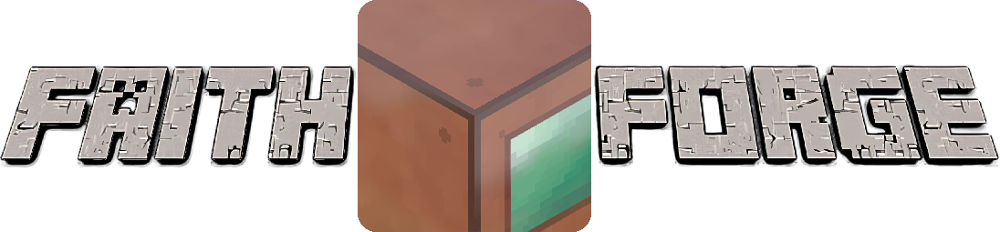

# FaithForge 

  

Just an ordinary but definitely not a simple faithful edit. 64 pixels of pure rgba, and that's squared! per texture!

Mod support list comming soon™!     (I mean, if you really want it rn open the assets folder, if the mod name is in there, it is at least partialy supported)

Normal and specullar mapping support is HEAVILY encouraged, POM is optional since it's still in early stage.

This pack has some content from and based of https://faithful.team 's Faithful 32 Resource pack, go give them some support!
Please don't re-release it and feel more than welcome to send screenshots at my shaderlabs channel! https://discord.gg/RpzWN9S
